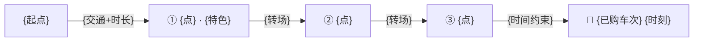

# 定制行程文章骨架模板

按序填充；`{}` 为占位符。成文范例见 `content/blogs/hengdian-yiwu-national-day-guide.md`。

````markdown
---
title: "{A} × {B} {节日/季节}{双人/X 人}定制 {N} 日（{出发地}出发 · 全程已订版）"
description: "为{人群}定制的{出发地}出发 {A}×{B} {N} 天 {N-1} 晚行程单：{D1 主题}、{D2 主题}、{D3 主题}；三段高铁、{酒店}、门票均已落定，附逐时行程、三餐安排、预算记账与出发清单"
summary: "行程已落定：{D1 一句动线}；{D2 一句动线}；{D3 一句动线}。车票+酒店+门票共 ¥{已落定合计}，待办只剩：{待办 1}、{待办 2}。"
date: "{核实日 YYYY-MM-DD}"
category: "生活分享"
tags: ["旅游攻略", "{A}", "{B}", "{节日}出行", "{人群}游"]
---

> {一句情绪 tagline：两地特色 × 出行人群钩子}。
>
> 📋 **定制说明**：本单按 {YYYY-MM-DD} 已落定的车票 / 酒店 / 门票撰写，时刻经 12306 与商户页面核实；演出场次与营业时间以出行当日官方公告为准。

> 🗂 **行程落定状态**
> ✅ **大交通**：{日期} {出发站} → {到达站} **{车次}**（{时刻}，¥{实付}/人）｜ {第二段} ｜ {第三段}
> 🏨 **酒店**：{酒店名}，{日期区间}（¥{实付}）—— {位置红利一句}
> 🎟 **门票**：{票种}（¥{实付}/双人）＝ {包含项}；⚠️ {关键限次/有效期规则}；{恰逢的活动档期}
> 💰 **已落定支出 ¥{合计}**（{人数}）＝ 交通 ¥{} + 酒店 ¥{} + 门票 ¥{}
>
> 🏆 **订票战绩**：{抢票背景一句，如"返程最高峰当日 12:00 起售——开售当天全中"}。

## 一、行程总览：{N} 天 {N-1} 晚双人定制

节奏设计：**D1 轻**（…）、**D2 重**（…）、**D3 顺**（…）。{一句整体亮点}。

| 天 | 主题 | 白天 | 夜晚 | 住宿 |
|---|---|---|---|---|
| D1 · {日期 周几} | {主题} | {动线} | {夜安排} | {酒店} |
| D2 · {日期 周几} | {主题} | {动线} | {夜安排} | {酒店} |
| D3 · {日期 周几} | {主题} | {动线} | {夜安排} | 回{出发地} |

### D1｜{日期（周几）}· 抵达日：{主题}

{住宿一句 + 当天总策略一句}。

- **{HH:MM} · {节点}**：{细节}
  - ⚠️ {避坑}
  - 💘 {情侣点}
- **夜 · 二选一**：
  - 🆓 {免费选项}
  - 🎫 {加购选项 + 建议理由}

### D2｜{日期（周几）}· 主场日：{主题}

{路线设计一句：受什么硬规则约束、走什么环线}。

> 🎪 **{档期限定活动}（{日期区间}）**：{活动清单；场次以当日时刻表为准}。

- **{HH:MM}-{HH:MM} · {景点}**：
  - {演出/必看，写具体时刻}
  - ⚠️ {避坑}
- **{HH:MM} · {转场/用餐}**：…
- ⚖️ **取舍说明**：{不可兼得项与选择理由}。

### D3｜{日期（周几）}· 收官日：{主题} → {压轴安排}

{行李/寄存策略一句}。

- **{HH:MM} {车次} {出发} → {到达}**（✅ 已购）：…
- **返程节奏**：{HH:MM} 前动身（{堵车/安检理由}）→ ✅ 已购 {车次} {时刻}
- {压轴安排一句}

## 二、大交通：三段高铁（全部已购）

以下时刻经 12306 官网查询（{YYYY-MM-DD}）并已按购买结果落定；出发前核对正晚点与检票口即可。

### ✅ {段名}（{日期}）{车次} 已购

| 车次 | 出发 | 到达 | 历时 | 二等座 | 状态 |
|---|---|---|---|---|---|
| **{车次}** | **{时刻 出发站}** | **{时刻 到达站}** | {历时} | ¥{实付} 实付 | ✅ 已购 |

> {这一段的节奏点评一句。}

### ✅ {中转段}（{日期} · {车次} 已购；{班次总量与替代方案}）

| 车次 | 出发 | 到达 | 建议 |
|---|---|---|---|
| {车次} | {时刻} | {时刻} | {点评} |
| **{已购车次}** | **{时刻}** | **{时刻}** | ✅ **已购**：{一句} |

> {兜底方案一句。}

### ✅ 返程（{日期} · {车次} 已购）

**最终方案 ✅**

| 车次 | 出发 | 到达 | 历时 | 二等座 | 点评 |
|---|---|---|---|---|---|
| **{车次}** | **{时刻}** | **{时刻}** | {历时} | ¥{实付} 实付 | ✅ **已购**：{一句} |

**备选参考（未购，退改签用）**

| 车次 | 出发 | 到达 | 历时 | 二等座 | 点评 |
|---|---|---|---|---|---|

### 🚕 落地短驳（大交通已订，全程只剩这些打车）

- **{站} ⇆ {酒店}**：打车 {N} 分钟 —— {哪两天各一趟}
- **{转场}**：{步行/打车 + 时长}
- **{返站}**：{HH:MM} 前动身避堵

**票务规则**：{有效期口径}；官方渠道 {url}。{限次规则与路线设计的关系一句}。

## 三、住宿：{酒店名}（已订 ✅）

✅ **{酒店名}**，{入住→退房}，{N} 晚 **¥{实付}**。

- **位置即行程红利**：{到各点的时间}
- {酒店特色一句}
- 落地动作：{入住/寄存提示}

## 四、定制三餐 & 采购清单

**🍜 三日吃饭安排（按已购车次落实）**

| 天 | 午餐 | 晚餐 |
|---|---|---|
| D1 · {日期} | {地点+菜+提示} | {地点+菜 → 夜宵} |
| D2 · {日期} | {…} | {…} |
| D3 · {日期} | {…} | {落地后的压轴安排，含取号提示} |

**🥡 必吃清单**

- {地1}：{餐厅×N（附口碑定位）}
- {地2}：{…}
- {压轴地}：{…}
- {放弃/下次再来的项，注明原因}

## 五、{购物地}：只逛{筛选条件}的店（D{N} 路线）

铁律先行：{市场现实一句}；开口话术：**"{话术}"**。

{半日路线一句话}。



**🛒 {筛选条件}清单（照着逛就行）**

- **① {点}（⭐）**：{怎么去 + 买什么 + 价格}
- **直接跳过**：{不符合条件的区域 + 理由}

## 六、{特色专题：宠物/亲子/摄影} 🐾

{现实定位一段：别抱不切实际预期}。

- **① {点位}**：{详情}
- 采购清单表（按对象/预算）

## 七、预算记账（实付 vs 预估）

| 项目 | 金额 | 说明 |
|---|---|---|
| {大项} | **¥{实付}** ✅ 已购 | {口径} |
| {待办项} | 约 ¥{区间} ⏳ | {估法} |
| 餐饮 | 约 ¥{区间} | {口径} |
| 购物 | 弹性 | {口径} |
| **已落定支出** | **¥{合计}** | {构成} |
| **全包预估** | **约 ¥{区间}** | {注明不含购物} |

## 八、出发前清单：只剩这几件事

**✅ 已办结**

- [x] {项}：{详情 + 金额}

**⏳ 待办（按优先级）**

- [ ] **{项}（建议）**：{内容与理由}

**🎒 出发当天**

- [ ] {清单项}

---

> 数据来源：{各数据口 + 核实日期 + "以出行当日官方公告为准"}。

### 主要参考笔记（{平台}）

- 《{文章名}》（{平台}，{热度/日期}）

### {票务/官方渠道}

- [{名称}]({url})
````
