> 室内钓虾 × 江边光影：中秋周末不出沪的懒人定制单——上午当「虾王」，下午看电影，傍晚去江边看灯，一条线开到底不回头。

## 🧭 行程速览

| 项目 | 安排 |
|---|---|
| **日期** | 2026.9.26（周六）· 单日往返 · 双人自驾（今年中秋只放 9.25 一天，26 日是普通周末，客流相对友好） |
| **路线** | 吴泾 → 宝山日月光（午餐+下午场）→ Gate M 西岸梦中心（傍晚）→ 吴泾 |
| **交通** | 自驾一条线：虹梅高架→中环去程 32km，中环→龙腾大道转场 28km，龙吴路返程 17km（时刻见交通节） |
| **门票** | 🆓 全程无门票：光影节分会场免预约；商场活动免费参与；唯一要买的是**电影票** |
| **预算** | 全包预估 **¥600-700**（2 人，不含购物）；目前 ¥0 已付 |
| **还差 2 件事** | ① 猫眼/淘票票买 9.26 星轶影剧院电影票 ② 出发前一晚盯天气（小雨照旧、大雨砍掉江边段） |

> [!info] 数据口径
> 餐厅信息经高德地图 POI 核实、活动情报经小红书笔记核实，均为 **2026-09-23** 查询；商场游园会时段、电影排片与光影节点亮情况以出行当日官方公告为准。9.26 天气预报：白天小雨、傍晚转阴，25-32℃（高德天气 9.23 查）。

## 一、行程总览：一条线玩三站，室内为主雨天无惧

节奏设计：**上午重**（赶早钓虾占位）、**午后松**（商场内游园会+电影，等雨停）、**傍晚顺**（西岸江边光影节，回家方向零绕路）。今年中秋档新片 9.25 扎堆上映，26 日正是场次最全的一天。

| 时段 | 主题 | 动线 | 场景 |
|---|---|---|---|
| 09:45-10:45 | 移动 | 吴泾 → 虹梅高架 → 中环 → 宝山日月光 | 车程约 57 分钟 |
| 10:45-13:45 | 钓虾主场 | 萌兰美陈打卡 → 正巨虾钓虾午餐（保底半斤） | 全室内 |
| 13:45-16:15 | 商场下午场 | 中秋游园会闯关 → 星轶影剧院看电影 | 全室内 |
| 16:30-17:15 | 移动 | 中环南下 → 龙腾大道 → 西岸梦中心 | 车程约 45 分钟 |
| 17:15-19:15 | 江边收尾 | 光影节分会场 + 黄浦江边日落 + 简餐 | 半室外（雨则砍） |
| 19:30-20:15 | 返程 | 龙腾大道 → 龙吴路 → 剑川路 → 吴泾 | 车程约 45 分钟 |

**全天自驾动线**（坐标经高德地图核实）：

```geojson
{
  "type": "FeatureCollection",
  "features": [
    { "type": "Feature", "properties": { "name": "吴泾镇", "label-dy": 18 }, "geometry": { "type": "Point", "coordinates": [121.455367, 31.038718] } },
    { "type": "Feature", "properties": { "name": "宝山日月光·正巨虾" }, "geometry": { "type": "Point", "coordinates": [121.417686, 31.295166] } },
    { "type": "Feature", "properties": { "name": "Gate M西岸梦中心", "label-dy": 18 }, "geometry": { "type": "Point", "coordinates": [121.465465, 31.161190] } },
    { "type": "Feature", "properties": { "name": "去程 32km" }, "geometry": { "type": "LineString", "coordinates": [[121.455367, 31.038718], [121.417686, 31.295166]] } },
    { "type": "Feature", "properties": { "name": "转场 28km" }, "geometry": { "type": "LineString", "coordinates": [[121.417686, 31.295166], [121.465465, 31.161190]] } },
    { "type": "Feature", "properties": { "name": "返程 17km" }, "geometry": { "type": "LineString", "coordinates": [[121.465465, 31.161190], [121.455367, 31.038718]] } }
  ]
}
```

**当日时间轴**：

```mermaid
gantt
    dateFormat HH:mm
    axisFormat %H:%M
    todayMarker off
    section 移动
    吴泾自驾去程 :d1, 09:45, 10:45
    section 宝山日月光
    萌兰美陈 快闪店 :q1, 10:45, 11:30
    正巨虾 钓虾午餐 :q2, 11:30, 13:45
    中秋游园会 :q3, 13:45, 14:00
    星轶影剧院 看电影 :q4, 14:00, 16:15
    section 移动
    取车南下西岸 :d2, 16:15, 17:15
    section 西岸梦中心
    光影节 江边简餐 :q5, 17:15, 19:15
    section 移动
    龙吴路返程回家 :d3, 19:30, 20:15
```



### 上午｜宝山日月光：先打卡后开钓，午餐就是主菜

- **10:45 抵达宝山日月光**（沪太路 1933 号）：直奔 B 栋 3 楼认门——正巨虾在 **B302**，距大场镇地铁站 1 号口步行 390 米，商场停车见交通节
- **11:00 · 萌兰主题美陈 + 中庭快闪店**：商场当前 IP 展「么么儿出逃计划 M.LanPanda」，顶流熊猫"三太子"主题美陈遍布中庭，快闪店 9.15 已开启（档期以商场公告为准）——💘 情侣拍照位先占上，钓完虾回来挑几张
- **11:30 前入座正巨虾**（10:00-21:00 营业，高德评分 4.5、人均 ¥116）：
  - 玩法 = 钓竿计时 + **保底半斤罗氏虾**现钓现加工，钓上来的直接进后厨
  - 💡 做法三选一：**白灼**（验鲜首选）、避风塘金蒜虾、咸蛋黄虾——白灼 + 避风塘各来一半最稳
  - ⚠️ 2025-09 有实测帖点名烧烤/炒菜踩雷（蛋炒饭腥、腌制发酸），原话"适合遛娃，不要用餐"——**只吃虾，烧烤类别点**
  - ⚠️ 节假日周末饭点排队，11:30 前入座基本免等

### 午后｜游园会 + 中秋档电影，商场里躲雨消食

- **13:45 ·「萌趣乐园」中秋游园会**：商场 9 月活动日历的 9.26 当天活动，闯关赢好礼（时段以商场当日公告为准）——等电影的空档正好玩一轮
- **14:00-16:15 · 星轶影剧院**（商场 K 区 L2 层 202，零移动）：中秋档 16 部新片 9.25 起扎堆上映，26 日场次最全——选片指南见第六节

### 傍晚｜西岸梦中心：光影节分会场 + 江边日落，回家方向零绕路

- **16:15 取车，16:30-17:15 中环南下**：上中路出口下来就是龙腾大道，滨江一路开到梦中心
- **17:15-19:15 · Gate M 西岸梦中心**（龙腾大道 2266 号，高德评分 4.9）：**第三届上海国际光影节分会场，免预约**（展期 9.17-10.16，常态化亮灯）——江边装置 + 西岸大草坪 + 简餐/咖啡，💘 傍晚江景是全程最松弛的一段
- **19:30 返程**：龙腾大道 → 龙吴路 → 剑川路，45 分钟到家

> [!important] 取舍说明
> 傍晚三选一里砍掉了两个：**宝山万达歌友会**（9.26 当天 18:30-20:30，免费）在日月光东北向，和回吴泾完全反向；**真如环宇城中意生活节**（9.24-27）虽在中环沿线，但论氛围不如西岸江景+光影节，二选一选西岸。9.25 中秋当天的宝山拜月大典（海江新天地汉服巡游）因不在 26 日，只能下次。

## 二、交通：自驾三段实测（高德 2026-09-23 路线）

两地斜穿市区无直达公共交通，自驾中环一线是明显最优解。三段均按实时路线规划实测：

| 段 | 路线 | 里程 | 实测时长 | 走法 |
|---|---|---|---|---|
| **去程** | 吴泾 → 宝山日月光 | 32.4km | 约 57 分钟 | 剑川路→虹梅南路高架→中环→汶水路→沪太路 |
| **转场** | 宝山日月光 → 西岸梦中心 | 28.1km | 约 45 分钟 | 沪太路→中环南下→上中路→龙腾大道 |
| **返程** | 西岸梦中心 → 吴泾 | 17km | 约 45 分钟 | 龙腾大道→银都路→龙吴路→剑川路 |

**🅿️ 停车情报**

- **宝山日月光**：商场停车场——⚠️ 小红书有"停车太乱"的吐槽帖，10:45 前到基本有位，**停好先拍楼层+车位号**
- **西岸梦中心**：自带地下停车场（龙腾大道 2266 号），傍晚到不用担心

<details>
<summary>🔄 备选方案与替代活动（折叠）</summary>

- **傍晚替代 ①**：宝山万达外广场「wmls 歌友会」9.26 当天 18:30-20:30，免费——适合想听歌合唱的晚上；代价是回吴泾多开 40 分钟回头路
- **傍晚替代 ②**：真如环宇城「中意生活节」9.24-9.27 11:00-21:00，手工披萨/Gelato 意式市集——离日月光仅 6-7km，适合不想再长途开车的懒人版
- **白天替代**：光影节分会场还有静安公园（市中心）、桃浦中央公园（紧邻大场）等 16 处，全部免预约；主会场上海音乐厅建筑投影需每日 12:00 抢实名预约，本行程不安排
- **雨天兜底**：西岸段砍掉，电影改晚场 + 日月光多逛一轮，19:00 前直接中环返程
- **不开车版**：吴泾出发公共交通需绕行换乘，耗时约翻倍——除非当天中环拥堵预警，否则不建议

</details>

## 三、住宿：一日往返，无需预订

单日行程当晚回吴泾，无住宿项。若临时想升级成两天一夜（把 9.25 中秋当天的拜月大典+汉服巡游也收进来），宝山日月光周边连锁酒店密集，届时另出一版。

## 四、定制三餐：钓虾就是主菜，晚餐交给江边

| 餐 | 安排 | 说明 |
|---|---|---|
| **午餐 11:30** | 正巨虾（宝山日月光 B 栋 3 层 B302） | 钓虾 + 保底半斤加工；白灼/避风塘双拼；⚠️ 不点烧烤炒菜类 |
| **下午茶 13:45** | 商场中秋游园会 + 快闪店 | 闯关赢的小零食先垫着 |
| **晚餐 18:00** | 西岸梦中心江边简餐 | 商场内餐饮选择多（咖啡/轻食/正餐都有），不用离开滨江 |

**🥡 必吃清单**

- **白灼罗氏虾**：检验现钓新鲜度的最佳做法，蘸姜醋
- **避风塘金蒜虾**：蒜香浓郁虾肉紧实，情侣分食第一口先给它
- **咸蛋黄虾**：风味层次最强，喜欢咸蛋星人必点
- **放弃项**：店内烧烤/蛋炒饭/腌制小串——2025-09 实测口碑翻车重灾区，钓虾店安心当钓虾店

## 五、钓虾玩法：新手四步，把「保底半斤」钓成「加菜」

正巨虾是室内垂钓池，目标罗氏虾，空调 + 座椅，雨天完全无感。保底半斤是底线，钓法对了远不止：

1. **饵料剪成米粒大小**——太大虾抱不动
2. **钩子完全藏进饵料里**——露钩 = 白给，这是成功的关键
3. **盯浮标**：轻微下沉或横向移动就是信号
4. **提竿要快**，动作干脆——犹豫就会错过

💘 情侣赛制建议：一竿定输赢，输的负责剥虾 + 下周洗碗。钓完把虾交给后厨，加工费按套餐口径现场确认。

## 六、中秋档电影：星轶影剧院三选一

星轶影剧院就在商场 K 区 L2（看完电影 16:15 直接取车，动线零损耗）。中秋档 16 部新片 9.25 起上映，情侣两人按口味三选一：

| 影片 | 类型 | 一句话理由 | 适合 |
|---|---|---|---|
| **《老江湖》** | 犯罪/剧情 | 于谦 × 梁家辉首度搭档，退休民警 vs 金融大佬的心理拉锯，主打演技口碑路线 | ⭐ 情侣首选 |
| **复联4 加码臻享版（重映）** | 超英/情怀 | 多约 4 分钟未公开片段，预售领跑整个档期 | 图热闹 / 补大银幕票 |
| **《目不转睛》** | 文艺/治愈 | 9.17 已上映的小众片，抑郁症女孩自愈故事，排片少要趁早 | 图走心 |

- 备选：《敦煌英雄》（章宇/窦骁，积压三年的河西走廊归唐史诗）
- ⏳ **建议 9.24 前在猫眼/淘票票锁座**：预售热的场次（尤其复联4）周六下午好位置会先没；选 14:00 前后开场，16:15 前散场才能接上西岸段

## 七、预算记账（全预估 · 暂 ¥0 已付）

| 项目 | 金额 | 说明 |
|---|---|---|
| 正巨虾钓虾午餐 | 约 ¥250-280 ⏳ | 人均 ¥116 口径 ×2（含保底半斤，超钓按斤） |
| 电影票 2 张 | ¥120-160 ⏳ | 中秋档新片 60-80/张，实价以猫眼为准 |
| 油费 + 停车 | 约 ¥100 ⏳ | 全天约 78km；两个商场停车 |
| 西岸梦中心晚餐 | 约 ¥120-150 ⏳ | 江边轻食/简餐口径 |
| 商场活动/光影节 | 🆓 | 游园会、萌兰美陈、光影节分会场均免费 |
| **全包预估** | **约 ¥600-700** | 双人口径，不含购物 |

## 八、出发前清单：只剩这几件事

**⏳ 待办（按优先级）**

- [ ] **买电影票（9.24 前）**：猫眼/淘票票搜「星轶影剧院（宝山日月光店）」，锁定 9.26 周六 14:00 前后场次，《老江湖》或复联4 加码臻享版
- [ ] **9.25 晚盯天气**：小雨→西岸照旧（打伞逛光影有氛围）；大雨/雷雨→砍西岸段启用雨天兜底
- [ ] （可选）电话确认正巨虾 9.26 等位情况与加工费口径

**🎒 出发当天**

- [ ] 伞、充电宝、湿巾/纸巾（钓虾用）、驱蚊液（江边傍晚）
- [ ] 09:45 前出发，11:30 前入座正巨虾
- [ ] 日月光停好车拍车位号；电影票二维码截图备用

---

> 数据来源：餐厅与路线经高德地图核实（2026-09-23）；活动信息经小红书笔记核实（2026-09-23）；中秋档影片信息经界面新闻/搜狐/猫眼公开报道核实。商场活动时段、电影排片与光影节点亮情况以出行当日官方公告为准。

### 主要参考笔记（小红书）

- 《2026‼️上海中秋好多免费的活动啊~》城市藏宝图（1190 赞）
- 《宝山日月光钓虾全攻略 🏆》黎恩（2025-09）
- 《探店正巨虾-室内垂钓踩雷》澈__（2025-09）
- 《上海光影节全攻略‼️主会场预约+16处分会场》尐泰斗（267 赞）
- 《宝山滨江 💌中秋&国庆节免费音乐会来啦！》魔都免费看展指南
- 《么么儿出逃计划 M.LanPanda萌兰来上海啦》宝山日月光中心（商场官号）
- 《汉服同袍招募｜🌕宝山中秋拜月大典+巡游》旭惠海江新天地
- 《中秋档 16 部新电影合集｜看这篇选片不踩雷》撰稿人知鱼

### 官方渠道

- [上海国际光影节](https://www.xiaohongshu.com/user/profile/6604e5cd000000000600f4a2)（小红书官方账号）
- 猫眼电影 / 淘票票（电影票务）
- 高德地图（路线与餐厅 POI）
