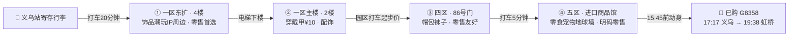

> 影视穿越 × 世界超市：上海出发的小情侣定制单——当一天群演、赶一场打铁花，再把"世界超市"的战利品拎回家。
>
> 📋 **定制说明**：本单按 2026-09-22 已落定的车票 / 酒店 / 门票撰写，时刻经 12306 与商户页面核实；演出场次与营业时间以出行当日官方公告为准。

> 🗂 **行程落定状态**
> ✅ **大交通**：10月4日 上海南 → 横店 **C3633**（09:50 → 11:57，¥184/人）｜ 10月6日 横店 → 义乌 **D3356**（09:01 → 09:18）｜ 义乌 → 上海虹桥 **G8358**（17:17 → 19:38，提前回沪吃晚饭线）
> 🏨 **酒店**：清明上河图亚朵X，10.4-10.6 两晚（¥1,945）—— 景区旁，看打铁花散场步行回家
> 🎟 **门票**：10.5 单日票（双人 ¥478）＝ 秦王宫 + 清明上河图 + 明清宫苑 + 广州街·香港街 + **赠送梦幻谷**；⚠️ **每园限进 1 次**（1 天自然日有效，凭身份证检票）；恰逢「入戏横店·红人季」（9.25-10.07：烟花 / 明星搭戏）；D1 镇区免费漫游，加购可选
> 💰 **已落定支出 ¥3,149**（2 人）＝ 交通 ¥726 + 酒店 ¥1,945 + 门票 ¥478
>
> 🏆 **订票战绩**：10月6日是国庆返程最高峰、车票 9月22日 12:00 才起售——开售当天三段全中；出发前只需在 12306 App 核对正晚点与检票口。

*▲ 秦王宫的高墙通道，进园第一张大片｜图：小红书《被吐槽"没意思"的秦王宫，我却看哭了😭》*

## 一、行程总览：三天两晚双人定制

节奏设计：**D1 轻**（落地 + 镇区漫游倒时差）、**D2 重**（单日票从开门玩到夜场）、**D3 顺**（义乌扫货顺路返沪）。横店的精华在夜里，两晚安排不重样。

| 天 | 主题 | 白天 | 夜晚 | 住宿 |
|---|---|---|---|---|
| D1 · 10/4 周日 | 抵达 · 镇区漫游 | 11:57 落地 → 万盛街 · 江滨绿道 · 追星 | 万盛街夜市（或加购广州街夜场） | 亚朵X |
| D2 · 10/5 周一 | 单日票主场 | 秦王宫 → 明清宫苑 → 广州街·香港街 | 梦幻谷《暴雨山洪》→ 清明上河图打铁花（双秀） | 亚朵X |
| D3 · 10/6 周二 | 义乌扫货 · 返沪 | 09:18 落地 → 商贸城零售路线 → 绣湖/鸡鸣阁 | G8358 落地虹桥 → 压轴晚餐 | 回上海 |

### D1｜10月4日（周日）· 抵达日：镇区漫游 + 追星（0 门票，票留给明天）

住**横店清明上河图亚朵X酒店**（已订：清明上河图景区旁，万盛南街美食街打车约 10 分钟）。单日票明天才生效，今天全天在镇上免费玩 + 追星。

- **11:57 抵达横店站**（已购：上海南 C3633，09:50 发车）：打车回酒店寄存行李（14:00 后入住）
- **午餐 12:15 · 万盛南街 · 二舅醉鸡煲**（明星常打卡）：药膳 + 花雕汤底，喝完不口干；**鸡肉下锅滚 2 分钟就捞**最嫩，蘸料加自制辣椒油
- **下午 · 免费三连（都在镇上，不进收费园区）**：
  - **万盛街步行街**：仿民国建筑本身就是剧组取景地，边逛边"验货"
  - **江滨绿道**：南江沿岸散步 / 租双人自行车，本地人同款遛弯路线
  - 💘 **追星点位**：万盛南街餐饮区背靠明星公寓「**南江一号**」——白天出妆通勤、傍晚收工来觅食，偶遇率高
- **加购选项 ·「横店国际马戏城」（原梦外滩，⚠️ 已改名别搜错）**：约 ¥160/人（线上常打折）——老上海街景 + 演出 + 民国大片，单买票不影响明天单日票
- **晚餐 17:00 · 万盛南街**：**醉爽贵州烙锅**（本地呼声第一）
- **夜 · 二选一**：
  - 🆓 **万盛街夜市**：横店最老牌夜市（2000 年开街）——老宋烧烤（剧组常光顾）、义乌拉面馆；**19:00-21:00 是明星收工觅食高峰**，剧组常去「湾」、313羊庄（需预约），蹲到就是赚到
  - 🎫 **加购广州街·香港街单景点票**：17:30 霓虹亮起租旗袍（押金 300/套），**维多利亚港夜景一亮秒变民国佳人** → 18:20《走进电影》**全场最强推**，和 TA 一起被招募参演 —— ⭐ **建议加购**：这场 18:20 的演出与 D2 夜场冲突，挪到 D1 晚看最顺
- 💡 今天全程不碰 10.5 单日票，明天才能从开门一直玩到夜场散场

*▲ 广州街·香港街 17:30 之后的旗袍夜色｜图：小红书《横店｜一袭旗袍入梦，赴一场民国旧约》*

### D2｜10月5日（周一）· 主场日：五园一线，从开门玩到打铁花散场

继续住亚朵X（清明上河图旁）。**充分玩的一天**：门票五园全含但**每园限进 1 次**，所以路线只走一个环——**上午南片（秦王宫）→ 午后北片（明清宫苑 → 广州街）→ 夜里回南片（梦幻谷 → 清明上河图打铁花）**。官方地理：南区三园（秦王宫/清明上河图/梦幻谷）相邻步行转场，北区两园（明清宫苑/广州街）紧挨步行——全天只有两次跨区打车，散场步行回酒店。早餐抓个**将军烧饼**就出发，8:00 开园即入，**无需换票、凭本人身份证检票**。

> 🎪 **国庆限定 ·「入戏横店·红人季」（9.25-10.07，全程覆盖你们的行程）**：官方活动一览——**看烟花**、飙演技、**明星陪你过国庆**；"一张门票，一次体验 10 个剧组"：霸总明星与你搭戏、反派老戏骨与你对戏、造梦师随时搭戏零基础也能飙得过瘾、沉浸式片场演艺随时随看。具体场次与烟花的时间地点以各园区当日时刻表为准——进园先拍时刻表。

*▲ 明清宫苑——1:1 的紫禁城，13:00 起连看四场演出｜图：小红书《横店游（二）》*

- **8:00-11:00 · 秦王宫**（国庆实测排队 2 小时+，开门就冲）：
  - 必看演艺三件套：8:30 秦王迎宾 ｜ 《英雄比剑》（剧情最佳）｜ 《帝国江山》巨幕 ｜ 玩的就是心跳《龙帝惊临》
  - ⚠️ 2025 国庆实测"园子小、人挤人"；真怕挤可换圆明新园（春苑人少、欧式宫殿，但**票不含、需另买**）
- **11:00-11:30 · 打车北上**（约 15 分钟，车上休整）
- **11:30-15:10 · 明清宫苑**（园区大，**先租双人脚踏车**；园内简餐当午饭，不耽误演出）：
  - 13:00 花车巡游 ｜ 13:30 清宫秘戏（可上台体验绿幕抠图）｜ 14:00 紫禁大典 ｜ 15:00 八旗马战（**别坐前排**，马蹄溅泥）—— 四场连看一场不落
  - 💘 御花园 = 甄嬛传 NPC 大本营，解锁"温太医甄嬛 100 问"；片酬可换纪念品
  - 💡 进园先拍门口**当日演出时刻表**——所有演出凭门票免费，国庆普遍加场
- **15:15-17:45 · 广州街·香港街**（北区两园紧挨，从明清宫苑**步行即到**）：
  - 必看演艺《怒海争风》《大话飞鸿》；15:40《魔幻风情》；民国街巷随手出片
  - 💘 17:00 租两套旗袍（押金 300/套）趁天光拍大片——**维多利亚港夜景一亮，秒变民国佳人**
  - 《走进电影》18:20 这场赶不上——**D1 晚加购补看**（见 D1）
- **17:45-18:15 · 打车南下梦幻谷**（15-20 分钟；晚饭就在车上啃将军烧饼，或 17:30 园区速食先吃）
- **18:15-19:35 · 梦幻谷**（15:00 已开园）：先玩摩天轮等项目，**19:00《暴雨山洪》**（26 分钟，百吨山洪倾泻，水花震撼）✓
- **19:45-21:00 · 清明上河图**（南区三园相邻，从梦幻谷**步行即到**）：
  - 灯笼夜景漫逛（16:30 起亮灯，夜游最出片）；《汴梁一梦》《你好，李清照》都是白天场，留待下次
  - 💘 **20:30 打铁花**——漫天星火下牵手，本行程最浪漫的一刻 ✓
- **21:00 · 步行回亚朵X**（酒店就在旁），完美收官
- ⚖️ **取舍说明**：《你好，李清照》是白天场——每园限进 1 次，白天进了清明上河图就赶不上夜里的打铁花，二选一**选打铁花**；《梦幻太极》20:00 与转场重叠，自动放弃；想两个夜秀都看，《走进电影》务必挪到 D1 晚。

*▲ 清明上河图 20:30 的打铁花——漫天星火落在水面上｜图：小红书《横店清明上河图打铁花》*

### D3｜10月6日（周二）· 收官日：义乌扫货 → 虹桥压轴晚餐

退房后带行李直达横店站。**义乌站寄存**：站内**无自助寄存柜**，出站找服务台走**人工寄存处**；或用「途简单」「存知己」小程序订义乌站周边寄存点（行李箱约 ¥10-20/天）——早上存、傍晚取都在义乌站，最顺。

- **09:01 D3356 横店 → 义乌**（✅ 已购，09:18 到）：出站打车 20 分钟，09:40 进场，仍在"人最少"窗口内
- **上午 · 国际商贸城**（9:30-10:30 人最少 ｜ 17:30 关门）：**只逛三个区**——一区（2 楼配饰/穿戴甲 10 元、4 楼玩具）、四区（86 号门帽包）、五区进口馆（零食 + 地球墙）
  - 铁律：90% 店铺不零售，进店先问"能否零售"；买多了可快递到家；拍照先问老板
  - 💘 给 TA 挑个小礼物：穿戴甲 10 元/副、鸭舌帽 15 元、进口零食
- **午餐 · 异国风味（义乌特色）**：首选 **苏坦土耳其餐厅·稠州总店**（稠州北路 475 号近宾王路，08:00-24:00，饭点大排长龙、12 点前到）——什锦咔吧、烤牛肉、米饭布丁；备选瑶氏醋炒鸡（囤 19.9 抵 50 券，一次可用两张）或四区 81 门 2 楼 7 街美食城速食
- **下午 · 绣湖 → 鸡鸣阁（可选）→ 返程**：
  - **绣湖公园**：市区地标，顺路湖边小憩；**鸡鸣阁**上山 10-15 分钟——不登顶免费、登顶约 ¥15，白天看全景（18:00 亮灯的夜景咱们赶不上，17:17 的车）
  - ⏱ **返程节奏**：15:00 前后五区收尾 → **15:45 前**打车回义乌站（17 点后堵车，务必避开）→ 取行李、安检进站 → **✅ 已购 G8358 17:17 → 19:38 上海虹桥**
  - 🍜 19:38 落地虹桥，回市区 20 点出头正好吃晚饭（虹桥天地餐厅推荐见第四节）
  - 🐾 给小狗小猫带礼物：五区 102 号门东广场「沣沛宠品 5E008」零售友好；时间富余再上 2 楼 7-12 街宠物专区淘，清单见第七节
  - 取舍提示：G8358 意味着放弃商贸城最后 1.5 小时与夜市——省下的力气留给虹桥商圈压轴晚饭

*▲ 鸡鸣阁 18:00 亮灯后的"浙中黄鹤楼"——本次赶不上，白天看全景，夜景留给下次｜图：小红书《义乌鸡鸣阁》*

## 二、大交通：三段高铁（全部已购）

以下时刻经 12306 官网查询（2026-09-22）并已按购买结果落定；出发前在 12306 App 核对正晚点与检票口即可。

### ✅ 去程 · 上海南 → 横店（10 月 4 日）C3633 已购

| 车次 | 出发 | 到达 | 历时 | 二等座 | 状态 |
|---|---|---|---|---|---|
| **C3633** | **09:50 上海南** | **11:57 横店** | 2时7分 | ¥184 实付 | ✅ 已购 |

> 11:57 落地不赶不慢：寄存行李 → 万盛南街午餐 → 镇上漫游从下午开始。

### ✅ 横店 → 义乌（10 月 6 日 · D3356 已购；全天 26 班 15-25 分钟直达，二等座 ¥18-23）

| 车次 | 出发 | 到达 | 建议 |
|---|---|---|---|
| G2026 | 06:43 | 06:58 | 太早，不推荐 |
| C3614 | 07:48 | 08:03 | 早到先吃早饭 |
| G7622 | 08:10 | 08:27 | 备选参考 |
| D2912 | 08:51 | 09:08 | 备选参考 |
| **D3356** | **09:01** | **09:18** | ✅ **已购**：09:40 进商贸城，仍在人少窗口内 |
| G1628 | 10:19 | 10:35 | 改签备选，商贸城少逛 1 小时 |

> 其余 20 班分布在 11:28-21:53，改签时选择充足；东阳北（C695 等 4 班）与轻轨义东段约 40 分钟可兜底。

### ✅ 返程 · 义乌 → 上海虹桥（10 月 6 日 · G8358 已购）

> 当日义乌→上海方向 70+ 班，只列到/经**上海南或上海虹桥**的傍晚前后主力班次（松江、金山北方向已排除），供退改签备选。

**最终方案 · G8358 提前回沪吃晚饭 ✅**

| 车次 | 出发 | 到达 | 历时 | 二等座 | 点评 |
|---|---|---|---|---|---|
| **G8358** | **17:17 义乌** | **19:38 上海虹桥** | 2时21分 | ¥156 实付 | ✅ **已购**：15:45 前动身，19:38 落地回市区吃晚饭 |

**备选参考（未购，退改签用）**

| 车次 | 出发 | 到达 | 历时 | 二等座 | 点评 |
|---|---|---|---|---|---|
| G1636 | 15:48 义乌 | 17:19 上海虹桥 | 1时31分 | — | 更早走，避开晚高峰 |
| G2176 | 15:10 义乌 | 16:57 上海南 | 1时47分 | — | 直达上海南 |
| C3196 | 16:06 义乌 | 18:12 上海虹桥 | 2时6分 | — | 备选 |
| G8364 | 16:49 义乌 | 18:53 上海虹桥 | 2时4分 | — | 备选 |
| G7366 | 19:38 义乌 | 21:11 上海虹桥 | 1时33分 | ¥119 | 夜市压轴路线（放弃夜市后不需要） |
| G1334 | 19:15 义乌 | 20:56 上海虹桥 | 1时41分 | ¥132 | 同上 |
| D378 | 19:22 义乌 | 21:48 上海南 | 2时26分 | ¥148 | 直达上海南 |

### 🚕 落地短驳（大交通已订，全程只剩这些打车）

- **横店站 ⇆ 亚朵X**：打车 15-20 分钟 —— 10.4 落地、10.6 早上出发各一趟
- **酒店 ⇆ 万盛南街**：打车 10 分钟（D1 两顿饭 + D2 早晚饭）；**酒店 ⇆ 清明上河图**步行即到
- **10.5 转场只跨区一次**：南区（秦王宫/清明上河图/梦幻谷）三园相邻步行转场，北区（明清宫苑/广州街）两园紧挨步行；南区 ↔ 北区打车 10-15 分钟（一天就一趟去一趟回）；园内靠步行 + 脚踏车
- **商贸城内部**：一区 → 四区 → 五区园区间打车起步价；**商贸城 → 义乌站**打车 20 分钟，15:45 前动身避堵
- **虹桥站 → 晚饭**：虹桥天地出站连廊步行 5 分钟，落地即达

**票务规则**：单景点票 1 天有效、联票 2 天有效、联票+梦幻谷 3 天有效；官方散客渠道 [e.hengdianworld.com](http://e.hengdianworld.com)。已购的 10.5 单日票含核心四园 + 赠送梦幻谷，**仅限当日、每园限进 1 次**（不可二次入园，行程已按此设计）；D1 若加购，单买"广州街·香港街"或"横店国际马戏城"单景点票即可，别动用明天的票。

## 三、住宿：清明上河图亚朵X（已订 ✅）

✅ **横店清明上河图亚朵X酒店**，10.4 入住 → 10.6 退房，2 晚 **¥1,945**。

- **位置即行程红利**：清明上河图景区旁——D2 的清明上河图就在酒店旁边、秦王宫与之相邻，打铁花散场回酒店最省力；万盛南街美食街打车约 10 分钟；去明清宫苑、横店站打车 10-15 分钟
- 亚朵 X = 亚朵旗下智能酒店品牌，智能客控 + 投屏大屏，晚上回房接着"看电影"氛围在线
- 落地动作：11:57 到店先寄存行李（14:00 后入住），前台顺口问当日演出时刻表与园区套餐

## 四、定制三餐 & 采购清单

**🍜 三日吃饭安排（按已购车次落实）**

| 天 | 午餐 | 晚餐 |
|---|---|---|
| D1 · 10/4 横店 | 12:15 万盛南街**二舅醉鸡煲**（药膳花雕汤底，鸡肉滚 2 分钟最嫩） | 17:00 **醉爽贵州烙锅** → 夜：万盛街夜市（老宋烧烤）/ 加购广州街夜场 |
| D2 · 10/5 横店 | 明清宫苑园内简餐（不耽误 13:00 演出） | 车上将军烧饼 / 园区速食 → 梦幻谷《暴雨山洪》+ 清明上河图打铁花双秀 → 散场步行回酒店 |
| D3 · 10/6 义乌→上海 | **苏坦土耳其·稠州总店**（稠州北路 475 号，08:00-24:00）或四区 81 门 2 楼美食城 | 19:38 落地虹桥 → **虹桥天地**（车站连廊步行 5 分钟）：**费大厨辣椒炒肉**（湘菜，先线上取号）· **宏烧鸟**（1 号小楼 A 座 3 楼，烧鸟/鳗鱼饭）· **烧烤共和国** · Blue Frog——多数营业到 22:00，国庆热门店务必提前取号 |

**🥡 必吃清单**

- 横店：醉爽贵州烙锅（本地呼声第一）· 二舅醉鸡煲（明星打卡）· 潮顺醉鸡煲 · 花厅里·猪油炒小菜 · 将军烧饼（万盛南街一条街搞定）；万盛街夜市：老宋烧烤（剧组常光顾）· 义乌拉面馆；明星同款餐厅：「湾」、313羊庄（19-21 点最可能撞见收工明星，需预约）
- 义乌：苏坦土耳其（什锦咔吧/开心果卡戴夫卷/米饭布丁）· 瑶氏醋炒鸡（19.9 抵 50 券）· 东河肉饼 · 红糖麻糍 · 木莲豆腐
- 上海虹桥（D3 压轴）：费大厨辣椒炒肉 · 宏烧鸟 · 烧烤共和国 · 蓝蛙
- 宾王/三挺路夜市（17:30-23:30）：土耳其烤肉卷 · 印度玛莎拉脆球 · 烤包子 · 牛杂汤 · 手工炒酸奶 —— 💘 情侣约会圣地，但 G8358 17:17 返程赶不上，**留作下次义乌的念想**

**🛍️ 买什么（情侣采购清单）**

- 商贸城一区：穿戴甲 10 元/副、配饰、4 楼玩具——给 TA 挑礼物的好地方
- 四区：鸭舌帽 15 元、包包 40-60 元、袜子断码零售
- 五区进口馆：各国零食 + 网红地球墙合影
- 宾王夜市：T 恤 100 元 3 件、耳环 15 元，报价可砍 10%-20%
- 伴手礼：红糖麻花、酥饼；横店 NPC 片酬换的纪念品（免费彩蛋）

> ⚠️ **商贸城避坑铁律**：进店先问"能否零售"（90% 不零售）· 17:30 关门上午去 · 买多了可快递 · 拍照先问老板

## 五、义乌国际商贸城：只逛支持零售的店（D3 路线）

铁律先行：商贸城 90% 是批发档口，**能否零售全看店家**。这条路线只保留"零售友好"的点；进店开口第一句固定话术：**"可以零售吗？少量怎么拿？"**——比直接问价管用得多。

D3 半日零售路线：**义乌站寄存行李 → 打车「一区东 12 号门」→ 东扩 4 楼 → 一区主楼 2 楼 → 四区 86 号门 → 五区进口馆收尾**。2-3 小时够用。

*▲ 全区品类速查图，按区逛更高效｜图：小红书《外地客商，义乌国际商贸城全区散客攻略大全》*

**🛒 零售友好清单（照着逛就行）**

- **① 一区东扩 4 楼（散客首选 ⭐）**：打车定位「**一区东 12 号门**」电梯直达 4 楼——饰品、潮玩、IP 联名周边，**多数店铺支持单件零售**；给 TA 挑礼物的主战场
- **② 一区主楼**：2 楼配饰·**穿戴甲 ¥10/副**（进店先问零售）；4 楼玩具商家自布置打卡点，部分店可零售
- **③ 四区 · 日用百货（对散客最友好）**：打车直接导航"四区 86 号门"——鸭舌帽 ¥15、包包 ¥40-60、1 楼袜子断码零售；4 楼美食城解决午餐
- **④ 五区 · 进口商品馆**：进口零食/洗护/母婴**明码标价可零售**（价格略高）；**网红地球墙**拍照；进口啤酒/巧克力伴手礼一站买齐；🐾 宠物家庭加站：102 号门东广场「沣沛宠品 5E008」（零售批发一体，详见第六节）
- **直接跳过**：二区（五金电子，整区批发逻辑）、三区（只顺路 64 号门一楼眼镜 ¥180-380）、五区 2 楼宠物批发街（99% 不零售，见第六节实测说明）——不零售的店多看一眼都是浪费时间

> 门号与方位以现场导航为准；穿运动鞋、轻装上阵，买多了直接快递到家。

## 六、给毛孩子的礼物：宠物用品指南 🐾

一只小狗一只小猫，回程行李箱里给它们留点空间。核心采买地是商贸城**五区宠物用品专区**（3 万+单品），但先看清零售现实：

> ⚠️ 2026 年实地实测：五区 2 楼 7-12 街整片宠物档口 **99% 只做批发外贸，基本不零售**；零售价对比淘宝拼多多**没有优势**。定位建议：把逛宠物区当成"淘货乐趣 + 开眼界"，主打下面那家零售集合店，别指望扫货省钱。

**📍 去哪儿买（两站搞定）**

- **① 沣沛宠品（五区 102 号门东广场 · 5E008）**：零售｜批发｜走播一体店，散客直接买。狗狗玩具挑花眼：响纸、BB 叫、绳结耐咬、毛绒公仔、飞盘、啃咬玩偶，小型犬到中大型犬齐全——**小狗的礼物主战场，零售友好首选**
- **② 五区 2 楼 · 7-12 街宠物用品专区**：导航「五区北大门 / 109 号门」上 2 楼左手边整片。单品超 3 万种：猫抓板（批发价约 ¥5）、牵引/背带（¥5-8）、宠物衣服（¥10 内）、自动喂食器（约 ¥50）、电推剪（¥30-50）——开眼界 + 碰运气磨零售
- **③ 线上兜底**：纯自用零售对比淘宝/拼多多没有优势，行程紧张可跳过，把时间留给夜市；或在集合店买点有义乌特色的玩具/衣服当伴手礼

**🛍️ 采购清单（按毛孩子对号入座）**

| 毛孩子 | 推荐买 | 价格参考 |
|---|---|---|
| 🐕 小狗 | 绳结/耐咬玩具、BB叫响纸玩具、牵引背带、宠物衣服、飞盘 | 批发价 ¥1-10，零售稍高 |
| 🐈 小猫 | 猫抓板、逗猫棒、猫窝、智能饮水机/喂食器、梳毛手套 | 猫抓板约 ¥5、智能喂食器约 ¥50（批发口径） |
| 共用 | 食盆水盆、电推剪（人宠两用 ¥30-50）、洗护用品、定制项圈 | 基础款便宜，智能款溢价 |

选品口诀：刚需款 = 猫抓板/牵引/逗猫棒/食盆；网红常青款 = 梳毛手套/自动逗猫/车载用品；预算给到 **¥50-200** 就能把两只都安排得明明白白。

## 七、预算记账（实付 vs 预估）

| 项目 | 金额 | 说明 |
|---|---|---|
| 高铁 3 段 | **¥726** ✅ 已购 | ¥363/人 = C3633 ¥184 + D3356 ¥23 + G8358 ¥156（二等座实付） |
| 住宿 2 晚 | **¥1,945** ✅ 已订 | 清明上河图亚朵X，10.4-10.6 |
| 门票（10.5 单日票） | **¥478** ✅ 已购 | ¥239/人 双人价；含核心四园 + 赠送梦幻谷，每园限进 1 次 |
| D1 加购（建议） | 约 ¥200-320 ⏳ | 广州街香港街夜场单景点票（补《走进电影》+ 旗袍照，首推）或 国际马戏城（原梦外滩）约 ¥160/人；不买则 D1 零门票 |
| 餐饮 | 约 ¥400-600 | 横店两晚 + 义乌午餐 + 虹桥压轴晚饭 |
| 购物 | 弹性 | 商贸城零售为主（夜市已放弃） |
| 🐾 宠物用品 | 约 ¥50-200 | 集合店零售 + 专区淘货，见第六节清单 |
| **已落定支出** | **¥3,149** | 车票 + 酒店 + 门票，2 人合计 |
| **全包预估** | **约 ¥3,800-4,300** | 再含 D1 可选加购、餐饮、宠物（不含购物） |

## 八、出发前清单：只剩这几件事

**✅ 已办结**

- [x] 车票三段：C3633 / D3356 / G8358（二等座共 ¥726）
- [x] 住宿：清明上河图亚朵X，10.4-10.6 两晚（¥1,945）
- [x] 门票：10.5 单日票（¥478/双人）—— 票面确认**含秦王宫/清明上河图/明清宫苑/广州街·香港街 + 赠送梦幻谷**；每园限进 1 次

**⏳ 待办（按优先级）**

- [ ] **D1 加购（建议）**：广州街·香港街夜场单景点票——17:30 旗袍照 + 18:20《走进电影》（这场与 D2 夜场冲突，挪到 D1 晚最顺）；纯省钱党可换成横店国际马戏城（原梦外滩，约 ¥160/人）或不加购
- [ ] **出发前 & 每天入园**：盯"横店影视城"公众号与园区**当日时刻表**——红人季（9.25-10.07）的烟花、明星搭戏场次以当日公布为准；并确认 10.5 单日票节假日是否需预约（国庆部分优惠票不可用）
- [ ] **虹桥晚饭取号**：落地前在美团/大众点评给虹桥天地热门店（费大厨等）**提前取号**，出站连廊步行 5 分钟直达

**🎒 出发当天**

- [ ] 查"横店影视城"官方公众号当日演出时刻表
- [ ] 行李：舒适鞋（日均 2 万步）· 防晒伞 · 充电宝 · 拍情侣照的浅色/古装系衣服 · 夜场薄外套
- [ ] 义乌返程：15:45 前从商贸城动身打车去义乌站（17 点后堵车），G8358 17:17 发车
- [ ] 🐾 毛孩子礼物：五区 102 号门东广场「沣沛宠品 5E008」（小狗玩具）+ 五区 2 楼 7-12 街专区（猫抓板/智能喂食器）

---

> 数据来源：车次时刻为 2026-09-22 经 12306 官网实时查询（已按购买结果落定）；门票权益、南北区动线与「入戏横店·红人季」活动以携程门票详情页及官方海报为准（2026-09 查）；餐饮信息经大众点评/携程/Trip.com 页面核实（苏坦稠州总店、虹桥天地商户等）；横店镇区漫游与追星点位参考横店兔（hengdiantour.com）、知乎追星攻略与都市快报报道，演出时刻与义乌购物避坑参考小红书高赞攻略（含 2025 年国庆实地笔记），商贸城零售情报综合 chinagoods/去哪儿等散客攻略；义乌寄存价格参考途简单/存知己平台页（2026-09）；演出场次与营业时间以出行当日官方公告为准；所有价格随市场变动，下单前请以 12306 / 携程 / 商户实时页面为准。文中配图截自小红书公开笔记（图注已标注出处），仅作行程氛围示意，版权归原笔记作者所有，如有侵权请告知删除。

### 主要参考笔记（小红书）

- 《原来横店义乌可以一起去！》熊猫派🐼（3769 赞）
- 《金华义乌横店 3 日攻略，经历无数次的穿越！》一只热爱行走的喵（1827 赞）
- 《横店影视城+义乌买买买 3 天 2 晚攻略》理李思路（2025 年 10 月 6 日国庆实地，含演出时刻表）
- 《横店 3 天 2 晚实测保姆级攻略✨》胖胖的旅行日记
- 《义乌 3 天 2 晚｜8 月避暑攻略✔️》南风有我意.
- 《上海→义乌+横店 3 天 2 夜攻略｜义乌篇》咔呲咔呲
- 《🎈上海—义乌—横店｜三天两晚攻略》克拉和斯特（上海出发车次实测）

### 票务官方渠道

- [横店影视城散客门票预订](http://e.hengdianworld.com)
- [横店影视城门票（Trip.com）](https://my.trip.com)
