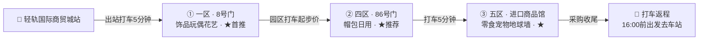

> 影视穿越 × 世界超市：上海出发，一起当群演、一起逛夜市、一起看打铁花。
>
> 🚦 **实时数据说明**：车次余票与酒店房价为 2026-09-20 晚经携程查询（已登录账号，酒店按双床房筛选），票价房态随时变动，下单前请复核。

> 🚨 **抢票警报（最重要的一件事）**：10月1日上海→横店 30 个车次（含加班车）二等座已全部售罄，10月2日 31 个车次仅剩 1 班有票。
> ✅ **对策**：① 现在就去 12306 对目标车次提交**候补**（国庆前退票会回流，携程显示"成功率较高"）；② 或**错峰**——9月30日晚 / 10月2日出发；③ 返程不慌：10月3日义乌→上海共 73 车次，白天车次充足。

## 一、怎么玩：3 天 2 晚行程（情侣版）

节奏：白天园区互动 + 拍照，晚上看演出——横店的精华全在夜里，两晚演出都不错过。

### D1｜抵达横店 → 明清宫苑 → 广州街·香港街（夜）

住横店（推荐万盛南街 / 秦王宫片区）。

- **中午前抵达横店站**（高铁约 2 小时）：打车去酒店放行李、前台激活联票，吃个横店本帮午餐（醉鸡煲）
- **下午 · 明清宫苑**（园区大，**先租双人脚踏车**）：
  - 13:00 花车巡游 ｜ 13:30 清宫秘戏（可上台体验绿幕抠图）
  - 14:00 紫禁大典 ｜ 15:00 八旗战马（**别坐前排**，马蹄溅泥）
  - 💘 御花园 = 甄嬛传 NPC 大本营，一起解锁"温太医甄嬛 100 问"；片酬可换纪念品
  - 彩蛋：恭亲王府、八大胡同人少易出片，可能偶遇剧组
- **傍晚-夜 · 广州街·香港街**：
  - 18:20《走进电影》**全场最强推**——提前到场有观众演员招募，和 TA 一起入戏参演
  - 19:15《大话飞鸿》 ｜ 19:35 8090 歌曲秀 ｜ 《怒海争风》水上实景
  - 💘 租两套旗袍/民国装（押金 300/套），17:30 霓虹亮起后拍港风情侣大片

### D2｜秦王宫（或圆明新园）→ 清明上河图 → 梦幻谷（夜）

继续住横店。

- **上午 · 秦王宫**（国庆实测：排队 2 小时+）：
  - 8:30 秦王迎宾 ｜ 《英雄比剑》（剧情最佳）｜ 《帝国江山》巨幕飞行影院
  - ⚠️ 2025 国庆实测秦王宫"园子小、人挤人"——**怕挤就换圆明新园**（人少、欧式宫殿、随手出片）
- **下午 · 清明上河图**（秦王宫步行可达）：
  - 《你好，李清照》**强推**（宋式美学 + 好哭的剧情）；网红《汴梁一梦》评价两极，可跳过
  - 戏精片场"如花来了""台词挑战"好玩；16:30 灯笼亮起后最出片
  - 💘 **20:40 限时打铁花**——漫天星火下牵手看，本行程最浪漫的一刻
- **晚上 · 梦幻谷**（二选一即可，不硬赶）：
  - 约 19:50《暴雨山洪》实景大秀（20 分钟，水花震撼）
  - 和打铁花时间冲突就二选一；体力富余可坐摩天轮收尾

### D3｜高铁 15 分钟 → 义乌扫货 → 返上海

行李寄存横店站或酒店，轻装去义乌。

- **上午 · 国际商贸城**（9:30-10:30 人最少 ｜ 17:30 关门）：**只逛三个区**——一区（2 楼配饰/穿戴甲 10 元、4 楼玩具）、四区（86 号门帽包）、五区进口馆（零食 + 地球墙）
  - 铁律：90% 店铺不零售，进店先问"能否零售"；买多了可快递到家；拍照先问老板
  - 💘 给 TA 挑个小礼物：穿戴甲 10 元/副、鸭舌帽 15 元、进口零食
- **午餐 · 异国风味（义乌特色）**：苏坦土耳其餐厅（稠州店：什锦咔吧、烤牛肉、米饭布丁），或瑶氏醋炒鸡（囤 19.9 抵 50 券，一次可用两张）
- **下午 · 鸡鸣阁 → 返程**（16:00 前出发去车站）：鸡鸣山爬 10 分钟上鸡鸣阁（免费"浙中黄鹤楼"，18:30 亮灯；赶车就白天看全景）
  - 🐾 给小狗小猫带礼物：五区 102 号门东广场「沣沛宠品 5E008」零售友好；时间富余再上 2 楼 7-12 街宠物专区淘，清单见第七节
  - 商贸城 → 义乌站打车 20 分钟，**17 点后堵车，赶车务必提前**

## 二、怎么去：实时车次（10 月 1 日-3 日）

以下为 2026-09-20 查询的国庆余票快照。去程严峻、返程宽松，策略 = 候补 + 错峰。

### 🚄 去程 · 上海 → 横店（10 月 1 日）

| 车次 | 出发 | 到达 | 历时 | 二等座 | 余票 |
|---|---|---|---|---|---|
| G3091 | 06:20 上海虹桥 | 08:46 | 2时26分 | ¥178 | 售罄·候补 |
| D377 | 08:11 上海南 | 10:35 | 2时24分 | ¥168 | 售罄·候补 |
| C3633 | 09:50 上海南 | 11:57 | 2时7分 | ¥191 | 售罄·候补 |
| C3611 | 10:13 上海虹桥 | 12:27 | 2时14分 | ¥189 | 售罄·候补 |
| G1627 | 13:31 上海虹桥 | 15:53 | 2时22分 | ¥202 | 售罄·候补 |
| G7621 | 21:15 上海虹桥 | 23:06 | 1时51分 | ¥163 | 售罄·候补 |

> 10月1日全天 30 个车次全部售罄；10月2日 31 个车次仅 **C3077**（17:53 上海南 → 20:28 横店，¥190）有票。建议：立刻 12306 候补首选车次 + 错峰备选（9月30日晚 / 10月2日下午）。

### 🚄 返程 · 义乌 → 上海（10 月 3 日，共 73 车次，票源充足）

| 车次 | 出发 | 到达 | 历时 | 二等座 | 余票 |
|---|---|---|---|---|---|
| G1334 | 19:15 义乌 | 20:56 上海虹桥 | 1时41分 | ¥132 | 有票 |
| D378 | 19:22 义乌 | 21:48 上海南 | 2时26分 | ¥148 | 有票 |
| D706 | 19:33 义乌 | 22:13 上海松江 | 2时40分 | ¥57 | 有票 |
| G7366 | 19:38 义乌 | 21:11 上海虹桥 | 1时33分 | ¥119 | 剩21张 |
| G1302 | 20:14 义乌 | 21:47 上海虹桥 | 1时33分 | ¥141 | 剩21张 |

> 白天车次更宽松；晚间部分车次已售罄（C412、G8358、D3206）。返程票不用抢，但建议本周内锁定。

### 🚕 当地接驳

- 义乌 ⇆ 横店：高铁 15 分钟（¥18-23）或轻轨义东段约 40 分钟；打车约 1 小时/¥70，不推荐
- 横店园区之间靠打车，园内步行/租脚踏车；明清宫苑大，建议租车
- 上海 ⇆ 义乌直达高铁约 1.5-2 小时（¥119-147），若选"义乌进横店出"也可行

**购票技巧**：OTA 平台搜"横店 酒店 2 晚 + 双人多景区联票"套餐，通常比分开买划算；联票至少提前 1 天线上购买。官方散客订票：[e.hengdianworld.com](http://e.hengdianworld.com)。票务规则：单景点票 1 天有效、联票 2 天有效、联票+梦幻谷 3 天有效。

## 三、怎么住：实时房态（10 月 1 日-3 日 · 2 晚）

2026-09-20 查询，已按**双床房**筛选，价格为"起价"（优惠后）。结论：横店双床房有房但部分紧俏，义乌房源充裕。

### 🏨 横店 · 双床房（欢迎度 Top）

| 酒店 | 位置与房型 | 双床房起价 | 一句话点评 |
|---|---|---|---|
| ⭐4.8 鼎豪派酒店（万盛南街店） | 万盛南街美食街 · 舒适双床房·智能客控·免费取消 | ~~¥525~~ **¥403 起** | 美食扎堆·步行觅食 |
| ⭐4.4 美季酒店（明清宫苑景区店） | 近轻轨站 · 优选双床房·30分钟免费取消 | ~~¥668~~ **¥322 起** | 性价比之选 |
| ⭐4.4 瑞祺酒店（影视城梦幻谷店） | 近秦王宫/梦幻谷 · 经济双床房·投屏+零压床垫 | ~~¥599~~ **¥376 起** | 低价房仅剩 2 间 |
| ⭐4.8 如家驿居酒店（圆明新园店） | 近清明上河图/秦王宫 · 双床房·巨幕投影 | ~~¥460~~ **¥417 起** | 投影房·情侣电影夜（仅剩 5 间） |
| ⭐4.5 台昆国际酒店（秦王宫店） | 近梦幻谷/秦王宫 · 雅致双床房·南北通透 | ~~¥508~~ **¥503 起** | 含丰盛自助早·免费停车 |
| ⭐4.8 横店承艺·国风红木美学空间酒店 | 近清明上河图园区 · 原木双床房·红木家具 | ~~¥748~~ **¥583 起** | 国风情侣照自带场景 |
| ⭐4.8 秦岚府花园酒店（清明上河图梦幻谷店） | 步行到核心景区 · 精选双床房·SIMMONS床垫+全屋智能 | ~~¥929~~ **¥789 起** | 地下停车场·品质之选 |

选址建议：秦王宫附近 = 横店 C 位出行方便；万盛南街 = 美食扎堆；追性价比选美季/瑞祺，追品质选秦岚府或承艺国风。预算型还有丫丫民宿（明清宫轻轨站，双人间 ¥199 起）。

### 🏨 义乌 · 双床房（共 766 家，房源充裕、无满房）

| 酒店 | 位置与房型 | 双床房起价 | 一句话点评 |
|---|---|---|---|
| ⭐4.5 义乌天兴酒店（绣湖轻轨站店） | 近三挺路夜市 · 城景商务双床房·包早 | ~~¥600~~ **¥487 起** | 下楼就是夜市 |
| ⭐4.7 昊丽酒店（国际商贸城店） | 国际商贸城 · 零压悦享双床房·包早 | ~~¥476~~ **¥404 起** | 扫货党首选 |
| ⭐4.6 义乌万达广场·栖梦里·M酒店（总部经济园店） | 万达广场 · 里享双床房·零压床品+投屏 | ~~¥609~~ **¥269 起** | 极致性价比（仅剩 3 间） |
| ⭐4.8 义乌万悦国际假日酒店（机场火车站店） | 近凌云地铁站 · 商旅豪华双床房·包早 | ~~¥743~~ **¥391 起** | 返程赶车友好 |
| ⭐4.7 国际博览中心酒店 | 毗邻国际商贸城 · 湖景双床房·包早 | ~~¥935~~ **¥653 起** | CBD 湖景夜景 |

## 四、怎么吃 & 买什么

**🍜 必吃清单**

- 横店：醉爽贵州烙锅（本地呼声第一）· 二舅醉鸡煲 · 潮顺醉鸡煲 · 将军烧饼（万盛南街一条街搞定）
- 义乌：苏坦土耳其餐厅（稠州店：什锦咔吧/开心果卡戴夫卷/米饭布丁）· 瑶氏醋炒鸡（19.9 抵 50 券）· 东河肉饼 · 醋炒鸡 · 红糖麻糍 · 木莲豆腐
- 宾王/三挺路夜市（17:30-23:30）：土耳其烤肉卷 · 印度玛莎拉脆球 · 烤包子 · 牛杂汤 · 手工炒酸奶
  - 💘 情侣夜市约会圣地，一人一半才好吃

**🛍️ 买什么（情侣采购清单）**

- 商贸城一区：穿戴甲 10 元/副、配饰、4 楼玩具——给 TA 挑礼物的好地方
- 四区：鸭舌帽 15 元、包包 40-60 元、袜子断码零售
- 五区进口馆：各国零食 + 网红地球墙合影
- 宾王夜市：T 恤 100 元 3 件、耳环 15 元，报价可砍 10%-20%
- 伴手礼：红糖麻花、酥饼；横店 NPC 片酬换的纪念品（免费彩蛋）

> ⚠️ **商贸城避坑铁律**：进店先问"能否零售"（90% 不零售）· 17:30 关门上午去 · 买多了可快递 · 拍照先问老板

## 五、义乌国际商贸城：分区路线与推荐清单

D3 上午半日扫货路线：**轻轨到「国际商贸城站」→ 打车至一区 8 号门进 → 一区 → 打车四区 → 五区收尾**。全程只逛 3 个区，2-3 小时够用。

> 分区示意（非严格比例）：**一区 = 必逛，四区 = 推荐，五区 = 推荐，二/三区 = 可跳过**（二区五金电子整区跳过；三区只顺路逛 64 号门一楼眼镜 ¥180-380）。门号与方位以现场导航为准。

**🛒 按区推荐清单（照着逛就行）**

- **① 一区 · 饰品玩偶花艺（首推）**：8 号门进 ｜ 女生逛最快的一区。2 楼配饰·**穿戴甲 ¥10/副**；4 楼玩具；东扩区毛绒/仿真花，很多店挂"可批可零"——给 TA 挑礼物主战场
- **② 四区 · 日用百货**：86 号门进 ｜ 打车直接导航"四区 86 号门"。帽包（鸭舌帽 ¥15、包包 ¥40-60）；一楼袜子断码零售；4 楼美食城解决午餐——刚需好物超划算
- **③ 五区 · 进口商品馆**：各国零食·洗护·母婴（价格稍高可零售）。**网红地球墙**拍照；进口啤酒/巧克力伴手礼一站式买齐；🐾 宠物家庭加站：102 号门东广场「沣沛宠品 5E008」（零售批发一体）

## 六、宠物用品采购指南 🐾

一只小狗一只小猫，回程行李箱里给它们留点空间。核心采买地是商贸城**五区宠物用品专区**（3 万+单品），但先看清零售现实：

> ⚠️ 2026 年实地实测：五区 2 楼 7-12 街整片宠物档口 **99% 只做批发外贸，基本不零售**；零售价对比淘宝拼多多**没有优势**。定位建议：把逛宠物区当成"淘货乐趣 + 开眼界"，主打下面那家零售集合店，别指望扫货省钱。

**📍 去哪儿买（两站搞定）**

- **① 沣沛宠品（五区 102 号门东广场 · 5E008）**：零售｜批发｜走播一体店，散客直接买。狗狗玩具挑花眼：响纸、BB 叫、绳结耐咬、毛绒公仔、飞盘、啃咬玩偶，小型犬到中大型犬齐全——**小狗的礼物主战场，零售友好首选**
- **② 五区 2 楼 · 7-12 街宠物用品专区**：导航「五区北大门 / 109 号门」上 2 楼左手边整片。单品超 3 万种：猫抓板（批发价约 ¥5）、牵引/背带（¥5-8）、宠物衣服（¥10 内）、自动喂食器（约 ¥50）、电推剪（¥30-50）——开眼界 + 碰运气磨零售
- **③ 线上兜底**：纯自用零售对比淘宝/拼多多没有优势，行程紧张可跳过，把时间留给夜市；或在集合店买点有义乌特色的玩具/衣服当伴手礼

**🛍️ 采购清单（按毛孩子对号入座）**

| 毛孩子 | 推荐买 | 价格参考 |
|---|---|---|
| 🐕 小狗 | 绳结/耐咬玩具、BB叫响纸玩具、牵引背带、宠物衣服、飞盘 | 批发价 ¥1-10，零售稍高 |
| 🐈 小猫 | 猫抓板、逗猫棒、猫窝、智能饮水机/喂食器、梳毛手套 | 猫抓板约 ¥5、智能喂食器约 ¥50（批发口径） |
| 共用 | 食盆水盆、电推剪（人宠两用 ¥30-50）、洗护用品、定制项圈 | 基础款便宜，智能款溢价 |

选品口诀：刚需款 = 猫抓板/牵引/逗猫棒/食盆；网红常青款 = 梳毛手套/自动逗猫/车载用品；预算给到 **¥50-200** 就能把两只都安排得明明白白。

## 七、预算参考（2 人总花费）

| 项目 | 估算 | 说明 |
|---|---|---|
| 高铁往返 | 约 ¥560-680 | 上海⇆横店/义乌二等座 ¥119-230/程/人，2 人往返 |
| 横店联票 | 约 ¥370-1,020 | 1日5景 ¥185 起/人 或 2日5景 ¥399 起/人；酒店+票套餐常更划算 |
| 住宿 2 晚 | 约 ¥650-1,600 | 实测横店双床房 ¥322-789/2晚（国庆价，双床房口径） |
| 餐饮 | 约 ¥400-600 | 夜市 + 本帮菜 + 1 顿土耳其餐 |
| 购物 | 弹性 | 夜市百元级随便买，商贸城看手速 |
| 🐾 宠物用品 | 约 ¥50-200 | 集合店零售 + 专区淘货，见第六节清单 |
| **合计（不含购物）** | **约 ¥2,000-3,800** | 2 人 · 3 天 2 晚 |

## 八、出发前检查清单

- [ ] **今晚就办**：12306 候补 10月1日目标车次（多个时段一起候补成功率更高），并订可免费取消的横店酒店占位
- [ ] **本周内**：锁定 10月3日返程票（如 G1302 20:14 义乌→上海虹桥）
- [ ] **提前 1 天+**：线上购横店联票，或直接订"酒店+双人联票"套餐
- [ ] **出发当天**：查"横店影视城"官方公众号当日演出时刻表
- [ ] **行李**：舒适鞋（日均 2 万步）· 防晒伞 · 充电宝 · 拍情侣照的浅色/古装系衣服 · 夜场薄外套
- [ ] **义乌返程**：商贸城 → 车站预留堵车余量，16:00 前出发
- [ ] **🐾 毛孩子礼物**：五区 102 号门东广场「沣沛宠品 5E008」（小狗玩具）+ 五区 2 楼 7-12 街专区（猫抓板/智能喂食器）

---

> 数据来源：车次余票与酒店房价为 2026-09-20 经携程（已登录账号）实时查询（酒店已按双床房筛选）；横店演出时刻、义乌购物避坑参考小红书高赞攻略（含 2025 年国庆实地笔记）；商贸城分区示意图为简化示意，实际门号以现场为准；宠物用品情报参考小红书《义乌商贸城宠物用品拿货攻略》（2026 实地实测）与「沣沛宠品·5E008」店铺笔记。所有价格与余票随市场变动，下单前请以 12306 / 携程 实时页面为准。

### 主要参考笔记（小红书）

- 《原来横店义乌可以一起去！》熊猫派🐼（3769 赞）
- 《金华义乌横店 3 日攻略，经历无数次的穿越！》一只热爱行走的喵（1827 赞）
- 《横店影视城+义乌买买买 3 天 2 晚攻略》理李思路（2025 年 10 月 6 日国庆实地，含演出时刻表）
- 《横店 3 天 2 晚实测保姆级攻略✨》胖胖的旅行日记
- 《义乌 3 天 2 晚｜8 月避暑攻略✔️》南风有我意.
- 《上海→义乌+横店 3 天 2 夜攻略｜义乌篇》咔呲咔呲
- 《🎈上海—义乌—横店｜三天两晚攻略》克拉和斯特（上海出发车次实测）

### 票务官方渠道

- [横店影视城散客门票预订](http://e.hengdianworld.com)
- [横店影视城门票（Trip.com）](https://my.trip.com)
